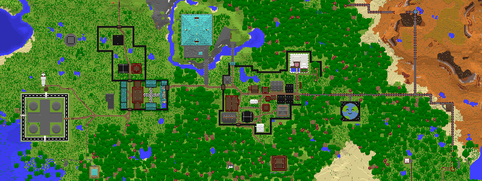
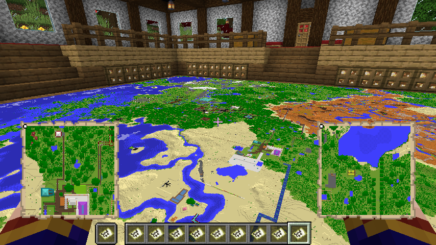
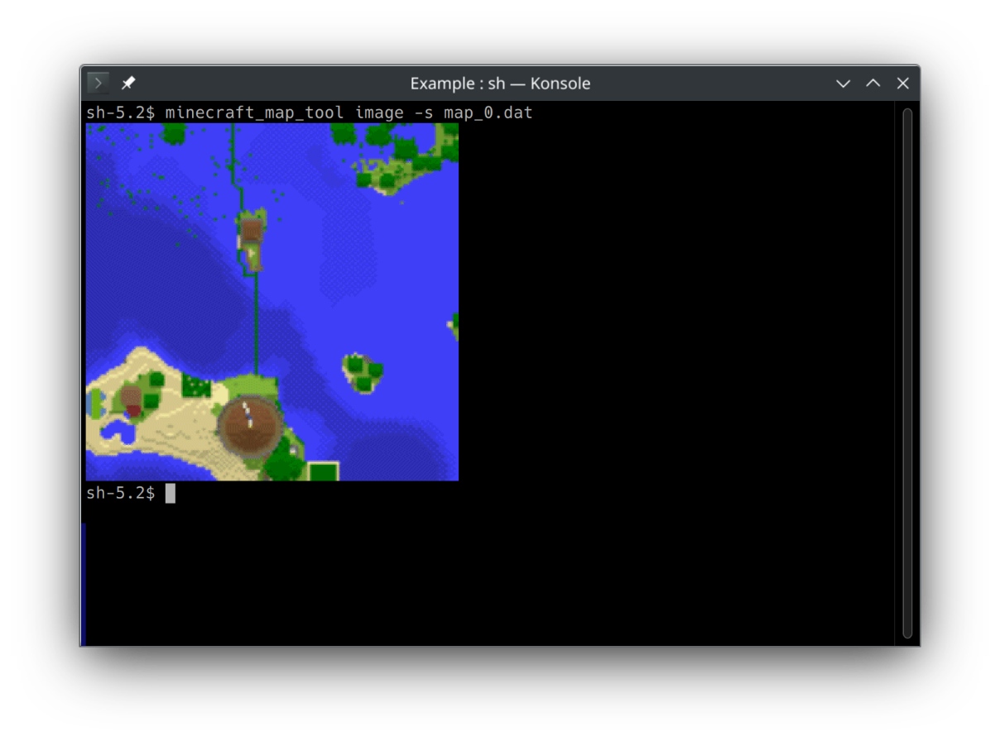

# Minecraft Map Tool



This repository has a program that can tell you information about the maps in the Minecraft game and draw pictures from them. I am developing this project for enjoyment and learning more about Rust and GitHub.

With luck, this program will also be helpful for others. Please note that the program handles the game's map items, the same ones we fill in the game. The program does not draw maps from the chunks.

## Example commands

In command examples, `$` indicates the input of the command prompt. It is followed by a command that you can type. Note that you do not type the `$`, only the command after it. Lines without the `$` sign are the example output of the program.

Some long lines are split into multiple lines with backslash `\`. You can write the whole command in one go without new lines and backslashes.

## Build

The program is written in rust. If you do not already have rust, we recommend you install it using `rustup`. The official rust [book](https://doc.rust-lang.org/book/) contains [instructions](https://doc.rust-lang.org/book/ch01-01-installation.html) on how to install rust on Linux, macOS, and Windows.

To build use the following command:

```bash
$ cargo build --release
```

We can now find tool binaries under to directory `target/release/`

## How to Use

Start by filling maps in the game.



Suppose the game is running on a server. Download the map files to your computer first. You need to know the location of map files to use this tool.

## Tools Available

We get list of available tools with the command:

```bash
$ minecraft_map_tool 
Utility for handling Minecraft map files

Usage: minecraft_map_tool <COMMAND>

Commands:
  info    Show information on map_#.dat file
  list    Show information from multiple maps in list form
  image   Create an image from a single map file
  images  Create images from multiple map files
  stitch  Drawing multiple maps into a single image
  help    Print this message or the help of the given subcommand(s)

Options:
  -h, --help     Print help (see more with '--help')
  -V, --version  Print version
```

### Info

**Help:**

```bash
$ minecraft_map_tool info --help
Show information on map_#.dat file

Usage: minecraft_map_tool info [OPTIONS] <FILE>

Arguments:
  <FILE>  Show info on this map_#.dat file

Options:
  -d, --dimension-from-path  Try to detect world dimensions from the file path instead of map item data
  -h, --help                 Print help
```

**Example:**

```bash
$ minecraft_map_tool info map_0.dat
╭──┤ map_0.dat ├──────────────────────────────╮
│                                             │
│  Scale      0          1:1                  │
│  Version    3700       Java Edition 1.20.4  │
│  Dimension  Overworld                       │
│  Locked     No                              │
│                                             │
├──┤ Tracking ├───────────────────────────────┤
│                                             │
│  Tracking position            Yes           │
│  Unlimited tracking           No            │
│                                             │
├──┤ Coordinates (X, Z) ├─────────────────────┤
│                                             │
│  Upper Left         -192        -576        │
│  Lower Left         -192        -449        │
│  Upper Right        -65         -576        │
│  Lower Right        -65         -449        │
│  Center             -128        -512        │
│                                             │
├──┤ Banners ├────────────────────────────────┤
│                                             │
│  Name      Color          X     Y        Z  │
│ ╌╌╌╌╌╌╌╌╌ ╌╌╌╌╌╌╌╌╌ ╌╌╌╌╌╌╌╌ ╌╌╌╌╌ ╌╌╌╌╌╌╌╌ │
│  Example   Cyan        -127     6     -508  │
│                                             │
├──┤ Frames ├─────────────────────────────────┤
│                                             │
│  Entity ID    Angle        X      Y      Z  │
│ ╌╌╌╌╌╌╌╌╌╌╌╌ ╌╌╌╌╌╌╌╌ ╌╌╌╌╌╌╌ ╌╌╌╌╌╌ ╌╌╌╌╌╌ │
│  5574         90        -134     59   -455  │
│  38797        180       -135    118   -464  │
│                                             │
╰─────────────────────────────────────────────╯
```

### List

**Help:**

```bash
$ minecraft_map_tool list --help
Show information from multiple maps in list form

Usage: minecraft_map_tool list [OPTIONS] <PATH>

Arguments:
  <PATH>
          The directory from which map files are searched for

Options:
  -r, --recursive
          Search map files recursively in subdirectories

  -s, --sort <SORT>
          Sorting order for files
          
          [default: name]

          Possible values:
          - name: Files are organized by name and numbers in the natural order
          - time: Files are organized from oldest to newest

  -d, --dimension-from-path
          Try to detect world dimensions from the file path instead of map item data

  -h, --help
          Print help (see a summary with '-h')
```

**Example:**

```bash
$ minecraft_map_tool list /path/to/data/directory/where/map/files/are
╭─────────────┬──────┬────────────┬────────┬───────────────┬───────┬────────┬───────┬────────┬─────────┬────────╮
│ File        ┆ Zoom ┆ Dimension  ┆ Locked ┆ Center        ┆ Left  ┆ Top    ┆ Right ┆ Bottom ┆ Banners ┆ Frames │
╞═════════════╪══════╪════════════╪════════╪═══════════════╪═══════╪════════╪═══════╪════════╪═════════╪════════╡
│ map_0.dat   ┆ 0    ┆ Overworld  ┆ 0      ┆ -128, -512    ┆ -192  ┆ -576   ┆ -65   ┆ -449   ┆ 1       ┆ 2      │
│ map_1.dat   ┆ 1    ┆ Overworld  ┆ 0      ┆ -192, -448    ┆ -320  ┆ -576   ┆ -65   ┆ -321   ┆ 0       ┆ 0      │
│ map_2.dat   ┆ 2    ┆ Overworld  ┆ 0      ┆ -320, -320    ┆ -576  ┆ -576   ┆ -65   ┆ -65    ┆ 0       ┆ 0      │
...
│ map_685.dat ┆ 0    ┆ Overworld  ┆ 0      ┆ 11392, -11520 ┆ 11328 ┆ -11584 ┆ 11455 ┆ -11457 ┆ 0       ┆ 1      │
╰─────────────┴──────┴────────────┴────────┴───────────────┴───────┴────────┴───────┴────────┴─────────┴────────╯
```

### Image

**Help:**

```bash
$ minecraft_map_tool image --help             
Create an image from a single map file

Usage: minecraft_map_tool image [OPTIONS] <MAP_FILE>

Arguments:
  <MAP_FILE>  Create image of this map_#.dat file

Options:
  -o, --output-file <OUTPUT_FILE>  Write the map image to the file. Standard file formats are supported
  -s, --show-in-terminal           Show map in terminal
  -h, --help                       Print help
```

**Example:**

```bash
$ minecraft_map_tool image -o map_0.png map_0.dat 
Image written to: "map_0.png"
```



### Images

**Help:**

```bash
$ minecraft_map_tool images --help                       
Create images from multiple map files

Usage: minecraft_map_tool images [OPTIONS] <PATH>

Arguments:
  <PATH>  The directory from which map files are searched for

Options:
  -o, --output-dir <OUTPUT_DIR>  Output directory. Default is the current directory
  -r, --recursive                Search map files recursively in subdirectories
  -d, --dimension-from-path      Try to detect world dimensions from the file path instead of map item data
  -h, --help                     Print help
```

**Example:**

```bash
$ minecraft_map_tool images -o images /path/to/data/directory/where/map/files/are          
Image written to: "images/Overworld/map_58.png"
Image written to: "images/Overworld/map_137.png"
Image written to: "images/The End/map_380.png"
...
```

### Stitch

**Help:**

```bash
$ minecraft_map_tool stitch -h
Drawing multiple maps into a single image

Usage: minecraft_map_tool stitch [OPTIONS] <PATH> <FILENAME>

Arguments:
  <PATH>      The directory from which map files are searched for
  <FILENAME>  Filename for the output image

Options:
  -d, --dimension <DIMENSION>  Only draw maps with matching dimensions name [default: Overworld]
      --recursive              Search map files recursively in subdirectories
  -s, --sort <SORT>            Image drawing order [default: time] [possible values: name, time]
  -z, --zoom <ZOOM>            Draw only maps with this zoom level [default: 0]
  -l, --left <LEFT>            Left coordinate (Smaller X)
  -t, --top <TOP>              Top coordinate (Smaller Z)
  -r, --right <RIGHT>          Right coordinate (Larger X)
  -b, --bottom <BOTTOM>        bottom coordinate (Larger Z)
  -h, --help                   Print help (see more with '--help')

```

**Example:**

```bash
$ minecraft_map_tool stitch --left=-448 --top=-1728 --right=1471 --bottom=191 \
	/path/to/data/directory/where/map/files/are \
	images/example.png
Found 686 map files.
After filtering we have 655 map files.
Map area
  Upper Left  : -2112 -11584
  Lower Right : 11455 191
  Size        : 13568×11776
Map area for image
  Upper Left  : -448 -1728
  Lower Right : 1471 191
  Size        : 1920×1920
Making image with size: 1920×1920
  Drawing maps [████████████████████████████████████████] 655/655 (0s)
  Saving image as "images/example.png"   
```
