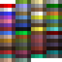

# File Information

The `map_0.dat` was generated with `minecraft_map_tool` using the `dev_tools` feature. It contains all possible map colors. The `map_0.png` file is a texture image captured from the Minecraft game with the help of the [apitrace](http://apitrace.github.io/).

The Image was optimized with the [OptiPNG](https://optipng.sourceforge.net/) using the following command:

```bash
optipng -o7 -zm1-9 -strip all map_0.png
```

Colors are still the same after optimization.

When `minecraft_map_tool` can render `map_0.dat` with the same colors as in `map_0.png`, it works correctly.



Last tested with Minecraft version 1.20.2

# Updating Test Image

Below is a brief description of how the test image is updated.

## World Prepare

To extract the map texture from Minecraft, we want to create and start a new creative world. We'll create a new map item when the world loads and then quit the game. Now, we replace the map we created with `map_0.dat` from this folder.

## Launching Minecraft with Apitrace

Next, we restart the game with the *apitrace*. An easy way to use *apitrace* is launching Minecraft using Prism Launcher. In Prism Launcher, we can add *apitrace* as a wrapper command:


Now, in the game, we open the world and hold the map item in hand to get a frame with our example map as texture. The test map file is locked, so the game will not overwrite its contents.

## Extracting Texture with qapitrace

We need to find a frame where we have the map in our hand. We can use <kbd>Ctrl</kbd>+<kbd>T</kbd> to make thumbnails of frames. 

Next, we expand all the commands of the appropriate frame, select them, and press <kbd>Ctrl</kbd>+<kbd>T</kbd>  to get pictures of the different rendering phases of the frame. We need to find the point where the map is being drawn and the map texture is loaded.

By double-clicking the appropriate rendering call, we get content for that point. The Surfaces tab has the texture we want.


Finally, we double-click on the texture to open it. In the texture viewer window, we want to check the flip checkbox and then save the image by pressing the right mouse button over the texture.